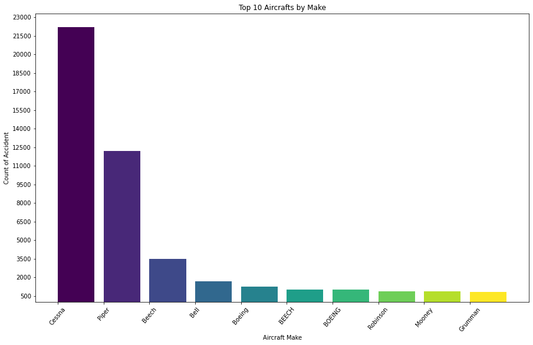
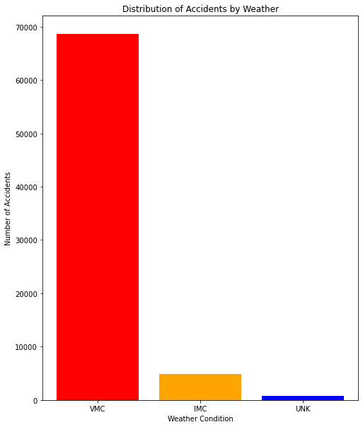
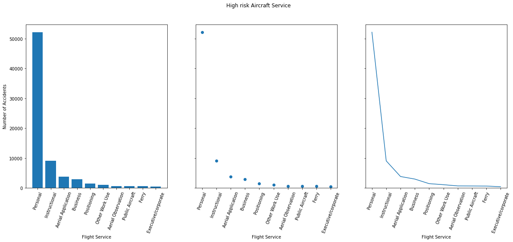
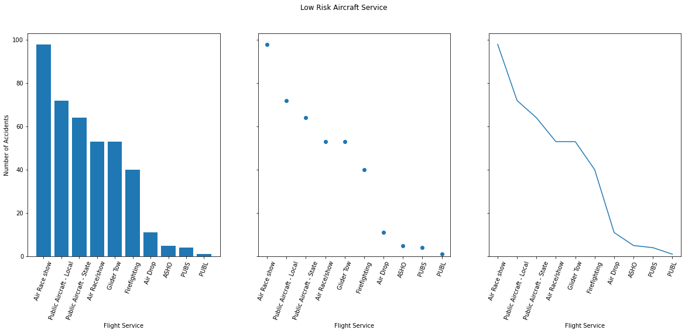

# jet flight

## Overview

This project analysis dataset is from [Aviation Accident Database & Synopses, up to 2023](https://www.kaggle.com/datasets/khsamaha/aviation-accident-database-synopses/code) to find the probable cause in aviation business.  The most equitable actions can be taken to produce quality analysis for a start-up business like Jet Flight by looking at historical data.

## Data Understanding

The NTSB aviation accident database contains information from 1962 and later about civil aviation accidents and selected incidents globally. The dataset is comprises of **31 columns** and **88,889 entries**. However, even with so much information, the dataset contains more than 30% of missing  values and syntax errors.

We believe that the "success" of aviation business can be measured by use of quality aircraft, by considering make and model less involved in accidents  and also the aviation service you consider venturing in

Note: The **Aviation Accident Database & Synopses, up to 2023** dataset is provided zipped in our data folder and  needs to be unzipped for data analysis.

## Insights

This project uses descriptive analysis in several forms to attempt to understand major success indicators the aviation industry to identify  potentially useful strategies for producing a successful business.

### Findings

**Aircraft Make**

Some aircraft make has high probability of being involved in an accident than others. Cessna and Piper have recorded high   accident rate as viewed from the dataset.

**Weather condition**

Weather is a very sensitive condition that should be highly considered when venturing into aviation indurstry. 
From our analysis, VMC is the most dangerous weather condition thus no airplane should be allowed to operate. IMC and UNK should also not be ignored   and the aircraft work team must be very keen during operations.

**Purpose_of_flight**

Jet Flight being a start-up company should consider venturing into services that are not prone to high risks. 
Aircraft Services like 'Personal', 'Instructional', 'Aerial Application' should not be offered by a start-up business like Jet Flight. They  
should consider Services like 'Public Aircraft', either offer it locally or globally because it has recorded a low risk to accidents

High risk aircraft services 

low risk aircraft services 

## Conclusion

According to analysis done on the used dataset, recent years indicate a decrease in Aircraft accidents. The growth of technology has positively   impacted aviation safety.

Although favorable weather conditions could appear to be less dangerous, they might occasionally cause pilots unsafe behaviors like flying at   low altitudes, high speeds, or engaging in aerobatics beyond what is considered safe.

Aviation accident tend to occur often among the most busy services, like, business service, personal service. Aviation authorities   should be involved to conduct thorough investigations into all kinds of flight services in order to identify any faulty issue and put safety precautions  in place to stop incidents.

## For Inquiries, Business Proposals and Additional Information

The analysis process is available in this [notebook](https://github.com/kamahTek/jet-flight/blob/master/flight.ipynb) and an [interactive tableau dashboard](https://public.tableau.com/app/profile/james.kamau/viz/FinalPhase_1_Project/JetFlightDashboard?publish=yes)

